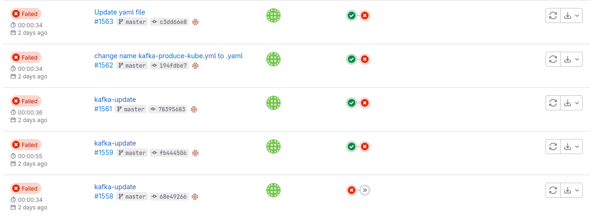
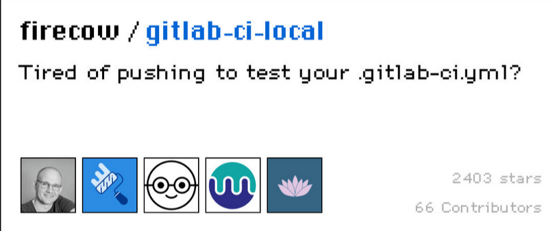
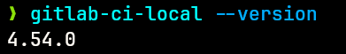
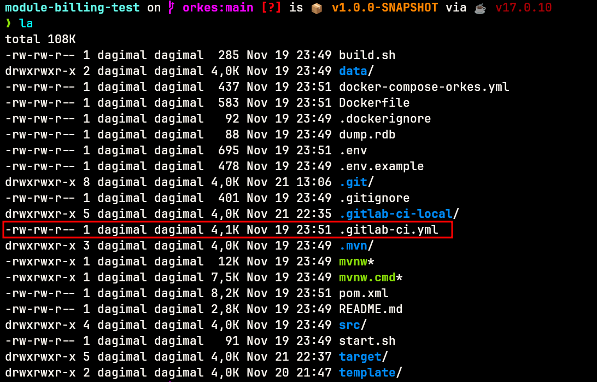
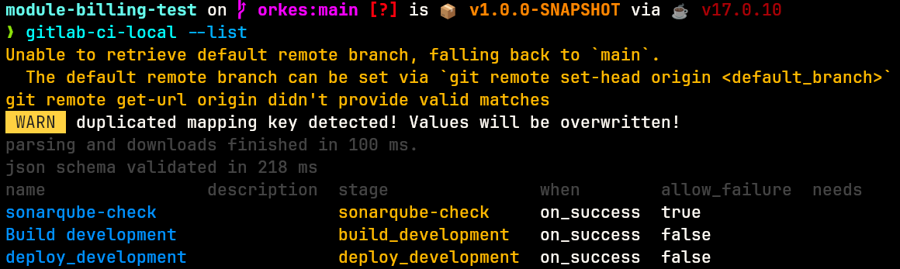
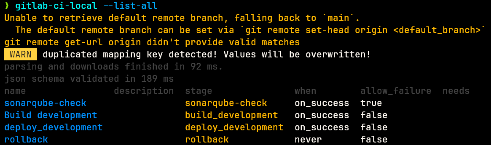
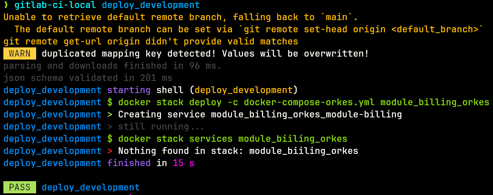

Pasti kalian kesel banget dong liat gambar diatas, gimana nggak kesel, udah capek2 bikin pipeline, ehh ketika di push malah error, belom lagi nunggunya lama cuma buat tau pipeline yang kita bikin sukses apa nggak.. Pengen nangis aja rasanya, apalagi errornya ga cuma sekali (baca: ***skill issue***) 😭

Untungnya, ada om Nielsen yang bikin tools menarik banget nih, yaitu

> **[GitHub - firecow/gitlab-ci-local](https://github.com/firecow/gitlab-ci-local)**

### 

### Sebenernya benda apa sih itu?

Simpelnya gini, *agent* yang ada pada ***[gitlab runner](https://docs.gitlab.com/runner/)*** di *cloning* dan bisa kita jalanin di mesin lokal kita 😱

### Emangnya kenapa tuh kalo bisa jalan di mesin lokal kita ?


hadeuhhh, jadi gini.. yang dimaksud bisa jalan di mesin lokal kita itu, dia bisa di **trigger langsung di mesin kita** tanpa lewat GitLab Web UI nya. Jadi kita bisa langsung testing dengan leluasa tanpa harus repot2 trigger dari GitLab 😜

### Lahh... Terus apa bedanya dong sama gitlab runner biasa ? Kan bisa jalan di lokal juga tuh

Bisa... tapi fiturnya nggak selengkap dan se-leluasa ini, lagian fitur ini udah ***deprecated*** dari gitlab nya alias udah ga bakal kepake lagi dan udah nggak di maintain lagi sama tim gitlab.

> source : https://gitlab.com/gitlab-org/gitlab/-/issues/385235

Oke, daripada kelamaan basa - basi, langsung kita praktek aja 🔬

## Instalasi

Karena aku disini pake Distro linux berbasis debian, instalasinya gini aja..

pertama, tambahin reponya dulu

```
sudo wget -O /etc/apt/sources.list.d/gitlab-ci-local.sources https://gitlab-ci-local-ppa.firecow.dk/gitlab-ci-local.sources
```

jangan lupa di update reponya

```
sudo apt-get update
```

terus install deh packagenya

```
sudo apt-get install gitlab-ci-local
```

untuk OS lain atau distribusi lain, bisa langsung cek aja di dokumentasi resminya

> https://github.com/firecow/gitlab-ci-local?tab=readme-ov-file#installation

## Pengetesan

setelah proses instalasi berhasil, pastikan dulu tools nya udah kepasang atau belum

```
gitlab-ci-local --version
```

ntar bakal muncul kaya gini



kalau udah kaya gitu, berarti tools udah kepasang, selanjutnya kita langsung masuk aja ke direktori dimana file .gitlab-ci.yml nya berada.



### List Pipeline Jobs

Kita bisa melakukan list job pipeline yang ada, dia akan auto detect dari file .gitlab-ci.yml nya itu

```
gitlab-ci-local --list
```

outputnya akan menjadi seperti ini



bisa dilihat, semua stage yang ada pada ci file nya akan terbaca. Kita juga bisa menambahkan option `--list-all` untuk menampilkan stage / job yang di set ke never



### Run Stage Jobs

Nahh, untuk melakukan pengujian pertama, kita bisa menjalankan stage tertentu pada file ci kita. Contohnya, aku pengen ngerun job / stage bernama `deploy_development`

```
gitlab-ci-local deploy_development
```

maka dia akan melakukan running job tersebut secara langsung



bisa dilihat seperti pada gambar, job nya **PASS** berarti sukses dijalankan.

kalian tinggal sesuaikan saja mau testing stage yang mana.

### Kesimpulan

Sebenarnya masih banyak fitur yang bisa di jelajahi, kalian bisa ngulik sendiri di dokumentasi resminya, yang di praktekkan disini cuma yang sering aku pake aja.
