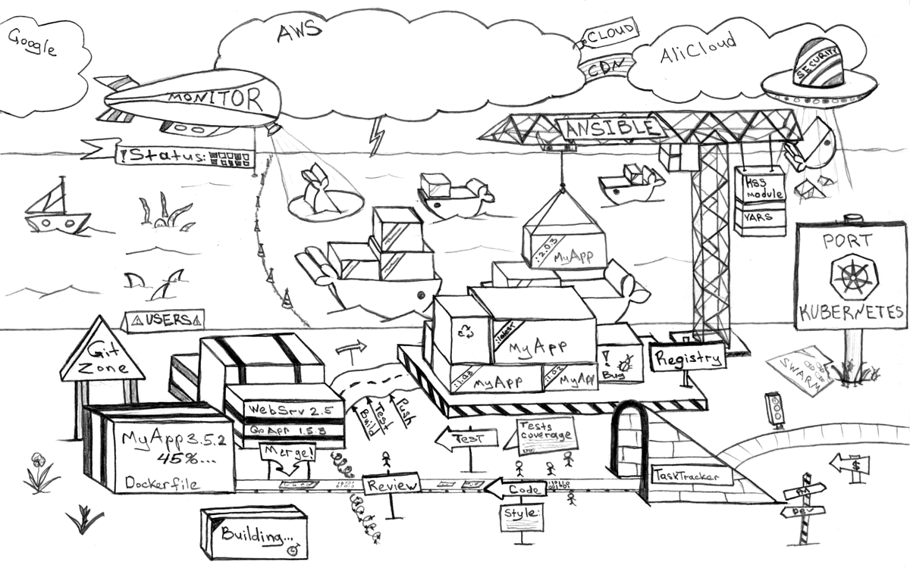

# Kilat Kubernetes Fundamental ⚡️

### Panduan untuk memahami konsep kubernetes secepat kilat

  

> **Seperti judul diatas, yap.. Ini adalah panduan fundamental kubernetes untuk pemula, dibuat khusus untuk orang yang pengen cepet paham kuber tapi males baca dokumen resmi, 3 jam dijamin paham! [kalo beneran praktek 😜]**

tulisan merupakan ini hasil *rewrite* dari artikel keren bikinan om **Rinor Maloku**

[learn kubernetes in under 3 hours a detailed guide to orchestrating containers](https://www.freecodecamp.org/news/learn-kubernetes-in-under-3-hours-a-detailed-guide-to-orchestrating-containers-114ff420e882)

Makasih banyak om 😇

Disini kita bakal belajar 3 hal utama :

- Menjalankan aplikasi ***Microservice*** di komputer kita
- Bikin ***Container Image*** untuk semua aplikasi ***Microservice***
- Pengantar Kubernetes, menerapkan aplikasi berbasis Container ke dalam Cluster yang dikelola Kubernetes.

Tanpa banyak basa-basi skuy langsung praktek...

## Demo Aplikasi

Aplikasi yang akan kita coba kali ini memiliki fungsi sederhana. Kita  hanya perlu memasukkan satu kalimat, kemudian akan di proses menggunakan ***Text Analysis*** dan selanjutnya akan di kalkulasi nilai emosi pada kalimat tersebut.

  
